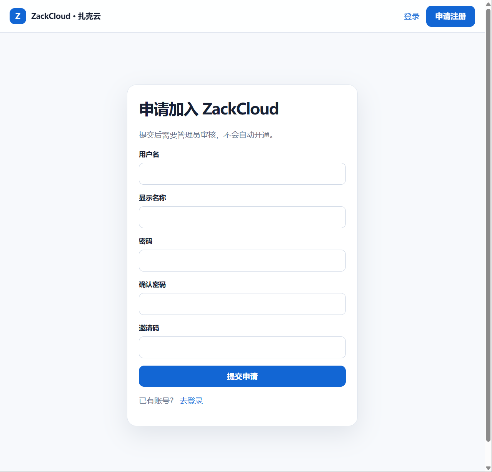
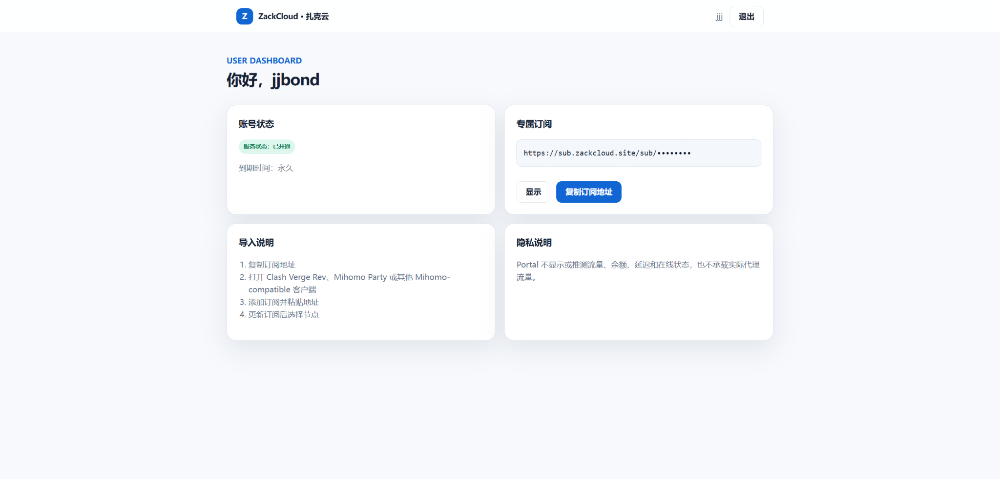

# ZackCloud Lite ☁️

一个基于 **Cloudflare Workers、D1、KV 和 GitHub Actions** 构建的轻量级订阅分发与用户管理系统。

🌐 **Website:** https://zackcloud.site

> 当前主要作为一个给朋友们使用的小型公益项目，同时也是我学习 Web、Cloudflare、Git 和工程化开发过程中的实践项目。

---

## ☁️ ZackCloud 是什么？

这是给 **扎克的好朋友们** 用的一个私人公益订阅小站。

需要使用的 hxd 可以直接 **私信扎克获取邀请码** 😎

注册完成后不会自动开通，需要等待管理员人工审核。

审核通过以后，每个用户都会获得自己的 **专属订阅地址**，可以导入 Mihomo / Clash Compatible 客户端使用。

> ZackCloud 不是商业机场，也不提供公开注册服务。

---

## ✨ Features

- 👤 用户注册与登录
- ✅ 管理员人工审核
- 🔑 每位用户独立订阅凭据
- 🔄 自动订阅更新
- 🚀 Mihomo / Clash 配置转换
- ☁️ Cloudflare Workers Serverless 架构
- 🗃️ Cloudflare D1 用户数据存储
- ⚡ Cloudflare KV Subscription Snapshot
- 🔐 Token 加密存储
- 🛡️ CSRF 防护
- 🚦 Rate Limiting
- 🧪 自动化测试
- 🔀 Production / Staging 环境隔离
- 🤖 GitHub Actions 自动更新上游订阅

---

## 🏗️ Architecture

ZackCloud Lite 将用户系统和订阅分发拆成了两条相对独立的链路。

### Subscription Pipeline

```text
Upstream Subscription
        │
        ▼
 GitHub Actions
        │
        ▼
    Converter
        │
        ▼
 Cloudflare KV
        │
        ▼
Subscription Worker
        │
        ▼
 Mihomo / Clash
```

### User Pipeline

```text
       User
        │
        ▼
 Portal Worker
        │
        ▼
 Cloudflare D1
        │
        ▼
Admin Approval
        │
        ▼
Subscription Credential
```

Portal 主要负责：

- 注册
- 登录
- 管理员审核
- 用户状态管理
- 专属订阅凭据生命周期

Subscription Worker 主要负责：

- 验证订阅凭据
- 从 KV 读取最新订阅 Snapshot
- 向 Mihomo / Clash 客户端分发配置

这样用户系统和实际订阅更新逻辑可以相对独立地运行。

---

# 🚀 给 hxd 的使用教程

整个流程其实很简单：

```text
找扎克拿邀请码
      ↓
注册 ZackCloud
      ↓
等待审核
      ↓
登录
      ↓
复制专属订阅
      ↓
导入客户端
      ↓
选择节点
      ↓
开冲（） 🚀
```

---

## 1️⃣ 获取邀请码

ZackCloud 暂时不提供公开邀请码。

需要使用的好几把哥们 **直接私信扎克** 即可。

拿到邀请码以后就可以开始注册。

---

## 2️⃣ 注册 ZackCloud

打开：

**https://zackcloud.site**

点击右上角：

**「申请注册」**

填写：

- 用户名
- 显示名称
- 密码
- 确认密码
- 邀请码



填写完成后点击：

**「提交申请」**

---

## 3️⃣ 等待审核

提交注册以后不会马上开通。

你的账号首先会进入等待审核状态：

```text
PENDING
   ↓
管理员审核
   ↓
APPROVED
```

扎克看到申请并确认身份以后，会在管理后台手动通过。

审核通过后即可正常登录 ZackCloud。

---

## 4️⃣ 登录并复制专属订阅

审核通过以后重新打开：

**https://zackcloud.site**

点击右上角：

**「登录」**

登录成功以后会进入用户 Dashboard。



在：

### 「专属订阅」

区域中点击：

**「复制订阅地址」**

即可获得属于你自己的订阅链接。

> ⚠️ 这个链接相当于你的私人凭据，请不要截图公开、上传到 GitHub 或随意转发给其他人。

---

# 📱 5️⃣ 下载客户端

目前推荐使用：

## FlClash

下载页面：

**https://flclash.cc/en/download**

支持：

- Windows
- Android
- macOS
- Linux

也可以使用其他支持 Mihomo / Clash 配置的客户端，例如：

- Mihomo Party
- Clash Verge Rev
- 其他 Mihomo Compatible 客户端

如果你不知道选哪个：

> **直接使用 FlClash 即可。**

---

# 🔗 6️⃣ 导入 ZackCloud

安装并打开客户端后：

1. 找到配置 / Profiles / 订阅相关页面
2. 添加一个新的远程订阅
3. 粘贴刚才从 ZackCloud 复制的专属订阅地址
4. 保存
5. 手动更新一次订阅
6. 进入代理 / 节点页面
7. 选择一个可用节点
8. 开启系统代理

正常情况下，更新完成以后会看到多个地区的代理节点。

---

# 🌏 7️⃣ 选择节点

如果不知道选哪个，可以优先使用：

### 🚀 扎克云 · 自动选择

让客户端自动选择当前延迟较好的节点。

也可以根据实际情况手动选择：

- 🇭🇰 香港
- 🇸🇬 新加坡
- 🇯🇵 日本
- 🇺🇸 美国
- 🇬🇧 英国
- 其他地区

某个节点偶尔出现 `Timeout` 并不一定代表整个 ZackCloud 出现故障。

换一个延迟正常的节点即可。

---

# 🧭 8️⃣ 推荐使用规则模式

日常使用推荐：

## 「规则」模式

规则模式下，客户端会根据配置判断哪些流量需要代理、哪些流量可以直接连接。

通常比把所有流量全部塞进代理更加适合日常使用。

如果需要使用：

## 「全局」模式

记得进入客户端中的：

```text
GLOBAL
```

策略组，并选择：

```text
ZackCloud
```

或者选择一个真实代理节点。

### 不要误选：

```text
DIRECT
REJECT
```

否则可能出现：

```text
规则模式正常
全局模式全部 Timeout
```

的情况。

---

# ❓ FAQ

## 为什么注册以后不能马上使用？

因为 ZackCloud 使用人工审核。

注册完成以后账号会先处于：

```text
PENDING
```

只有管理员审核通过进入：

```text
APPROVED
```

以后才能正常获得并使用订阅。

---

## 为什么邀请码不公开？我都能知道你扎克是谁还要我私信找你？

ZackCloud 目前只给认识的朋友使用。

邀请码提供第一层限制，注册以后仍然需要我人工审核。

这样可以减少：

- 垃圾注册
- 自动化脚本注册
- 无意义请求
- 陌生用户滥用服务

需要使用直接我即可。

---

## 为什么导入订阅以后没有节点？

首先尝试：

**手动更新一次订阅。**

如果还是没有节点：

1. 确认复制的是完整的 ZackCloud 专属订阅地址
2. 删除客户端中的旧订阅
3. 从 ZackCloud Dashboard 重新复制订阅地址
4. 再次添加
5. 手动更新订阅

---

## 为什么有一些节点显示 Timeout？

节点状态本身可能随时发生变化。

如果某个节点显示 Timeout：

- 换一个延迟正常的节点
- 或者直接使用「自动选择」

只要其他节点能够正常测速和连接，一般不代表 ZackCloud 整体出现故障。

---

## 为什么规则模式可以用，全局模式却不行？

先检查客户端中的：

```text
GLOBAL
```

策略组当前选择了什么。

应该选择：

- ZackCloud
- 自动选择
- 某个真实代理节点

如果选择：

```text
DIRECT
```

流量不会经过代理。

如果选择：

```text
REJECT
```

网络请求会直接被拒绝。

---

## 我的订阅地址可以发给别人吗？

### 不要分享。

每个 ZackCloud 用户都有自己的专属订阅凭据。

请不要：

- 转发给其他人
- 发到群里
- 上传到 GitHub
- 截图泄露完整链接
- 放到任何公开网站

ZackCloud 目前属于朋友之间使用的公益性质小池子，**整个池子每月目前只有约 100 GB 的流量额度**。

大家实际上共享的是一个有限的公共流量池。

如果把自己的订阅继续分享给其他人，对方使用产生的流量同样会消耗这个池子的公共额度。

一旦公共额度被耗尽：

> **别人用不了了，你自己也用不了了。**

所以最简单的原则就是：

### 自己用自己的订阅，不要二次分享。

如果你的朋友也需要使用，让他直接联系扎克申请自己的账号即可。

---

# 👨‍💻 For Developers

如果你只是想使用 ZackCloud，看到这里其实已经够了。

下面主要记录这个项目本身的技术实现。

ZackCloud Lite 最开始只是为了方便几个朋友使用。

后来随着实际使用需求增加，逐渐加入了：

- 用户系统
- 管理员审核
- 独立订阅凭据
- 自动订阅更新
- KV Snapshot
- D1 数据库
- 加密存储
- Rate Limiting
- CSRF 防护
- Production / Staging 隔离
- GitHub Actions 自动化

最后慢慢变成了一个完整的小型 Serverless Web 项目。

这个项目本身也是我的一个学习项目。

如果代码里存在：

- 不够优雅的实现
- 不合理的架构
- 潜在 Bug
- 安全问题
- 可以优化的地方

非常欢迎指出。

---

# 🧰 Tech Stack

## Backend / Runtime

- TypeScript
- Cloudflare Workers

## Database

- Cloudflare D1

## Subscription Distribution

- Cloudflare KV

## Automation

- GitHub Actions

## Deployment

- Wrangler

## Testing

- Vitest
- TypeScript Typecheck
- ESLint
- Custom Security Scan

## Client Configuration

- Mihomo / Clash YAML

---

# 🔐 Security Design

ZackCloud 的安全原则之一是：

> **生产环境 Secret 不进入 Git。**

生产环境中的敏感配置通过：

- Cloudflare Worker Secrets
- GitHub Actions Secrets

进行管理。

包括但不限于：

```text
UPSTREAM_SUBSCRIPTION_URL
TOKEN_ENCRYPTION_KEY
ADMIN_PASSWORD_HASH
REGISTRATION_INVITE_CODE_HASH
CLOUDFLARE_API_TOKEN
```

仓库中只应该出现变量名称，而不应该出现真实值。

---

## 🔑 Password Storage

用户密码不会以明文形式存储。

当前密码派生方案使用：

```text
PBKDF2-HMAC-SHA256
WebCrypto
Random Salt
20,000 iterations
```

管理员密码使用相同的版本化可移植 Hash 格式。

---

## 🎫 Subscription Credential

每位获批用户拥有独立的 Subscription Credential。

用户拿到的是类似：

```text
https://sub.zackcloud.site/sub/<USER_TOKEN>
```

形式的专属订阅地址。

真实 Token 不应进入源码或 Git。

Portal 对需要保存的订阅凭据进行加密处理，Subscription Worker 则负责验证访问权限并分发订阅。

---

## 🛡️ CSRF Protection

Portal 对需要修改服务端状态的请求进行 CSRF 防护，包括：

- Session 绑定
- CSRF Token
- Cookie 校验
- Origin 检查
- Same-Origin Navigation 检查

---

## 🚦 Rate Limiting

用户登录与管理员登录使用独立的 Cloudflare Rate Limiting。

当前分别限制：

```text
User Login
10 requests / 60 seconds

Admin Login
5 requests / 60 seconds
```

Rate Limit 会在昂贵的密码派生计算之前生效，用于降低暴力登录和无意义请求产生的资源消耗。

---

# 🗃️ Cloudflare D1

D1 主要负责保存：

- 用户
- 用户状态
- Password Hash / Salt
- Subscription Credential
- Session
- Audit Log

用户生命周期主要包含：

```text
PENDING
APPROVED
REJECTED
DISABLED
```

只有有效且已经批准的用户才能正常获得订阅服务。

---

# ⚡ KV Snapshot

ZackCloud 不会让每一个朋友的客户端请求都实时访问上游订阅。

订阅更新链路大致是：

```text
GitHub Actions
      │
      ▼
Fetch Upstream
      │
      ▼
Validate
      │
      ▼
Convert
      │
      ▼
Cloudflare KV Snapshot
      │
      ▼
Subscription Worker
      │
      ▼
Client
```

Subscription Worker 只需要读取已经经过转换与验证的 Snapshot。

同时支持：

- ETag
- HTTP 304
- Snapshot Validation
- Last Known Good Snapshot

这样即使某一次上游更新发生异常，也可以尽量避免直接把坏配置分发给所有用户。

---

# 🔀 Production / Staging

ZackCloud 将正式环境和测试环境分离。

```text
Production
├── Portal Worker
├── Subscription Worker
└── Production D1

Staging
├── Portal Worker
├── Subscription Worker
└── Staging D1
```

Production 与 Staging 拥有独立的：

- 用户数据库
- Portal Worker
- Subscription Worker
- Worker Secrets
- 登录 Rate Limit Namespace

这样可以尽量避免测试代码直接影响正式用户。

---

# 🤖 GitHub Actions

GitHub Actions 定时负责获取并更新 Subscription Snapshot。

整体流程：

```text
Scheduled / Manual Action
          │
          ▼
Fetch Subscription
          │
          ▼
Safe Validation
          │
          ▼
Convert Mihomo YAML
          │
          ▼
Validate Structure
          │
          ▼
Upload KV Snapshot
```

真实上游订阅地址只存在于 GitHub Actions Secret 中，不进入公开仓库。

---

# 🧪 Testing

项目在部署前会运行：

```bash
npm test
npm run typecheck
npm run lint
npm run security:scan
```

当前项目拥有 **200+ 自动化测试**。

覆盖内容包括：

- 用户注册
- 用户登录
- 管理员登录
- 注册邀请码
- 用户审核生命周期
- Token 生命周期
- D1
- KV Snapshot
- Subscription Worker
- ETag
- HTTP 304
- Rate Limiting
- CSRF
- Production / Staging 隔离
- Mihomo 配置结构
- Proxy Group 引用完整性
- Legacy Compatibility

---

# 📌 Project Status

Current Version:

## ZackCloud Lite v0.7

目前已经完成：

- ✅ 用户注册
- ✅ 用户登录
- ✅ 管理员审核
- ✅ 用户拒绝
- ✅ 用户禁用 / 恢复
- ✅ 用户删除
- ✅ 独立 Subscription Credential
- ✅ Token Rotation
- ✅ Production Deployment
- ✅ Staging Environment
- ✅ Cloudflare D1
- ✅ Cloudflare KV Snapshot
- ✅ GitHub Actions 自动更新
- ✅ Mihomo / Clash 配置转换
- ✅ Mihomo 客户端真实订阅导入
- ✅ 真实代理节点连接
- ✅ Rule Mode
- ✅ Global Mode
- ✅ ETag / HTTP 304
- ✅ 自动化测试
- ✅ Security Scan

项目目前已经完成真实客户端的 End-to-End 验证。

---

# 💡 Feedback & Contributing

这个项目仍然还有很多可以继续优化的地方。

如果你对下面这些方向比较熟：

- Cloudflare Workers
- Serverless Architecture
- Cloudflare D1
- Cloudflare KV
- Web Security
- Authentication
- Cryptography
- Rate Limiting
- Mihomo / Clash
- GitHub Actions
- TypeScript
- UI / UX
- Git / CI/CD
- 软件工程

非常欢迎提出建议。

如果发现：

- Bug
- 安全问题
- 架构问题
- 不合理的代码
- 可以优化的实现
- UI / UX 问题
- 文档错误

欢迎提交 **GitHub Issue**。

如果只是有一些想法，也欢迎直接告诉扎克 😎

> 这个项目本身也是我的学习项目。
>
> 如果代码里有写得不够优雅、设计得不合理或者存在更好的工程实现，非常欢迎指出。

---

# ⚠️ Disclaimer

ZackCloud 主要用于：

- 个人学习
- 技术研究
- 软件开发实践
- 受邀朋友之间的非商业使用

使用者应自行遵守所在地法律法规以及相关网络服务的使用条款。

本项目不提供任何商业代理服务。

---

# ⭐

如果这个项目对你有一点帮助，欢迎点个 Star ⭐

如果你看到代码以后觉得：

> **“这里写得真烂，我教你怎么改。”**

也非常欢迎。

我会认真看的